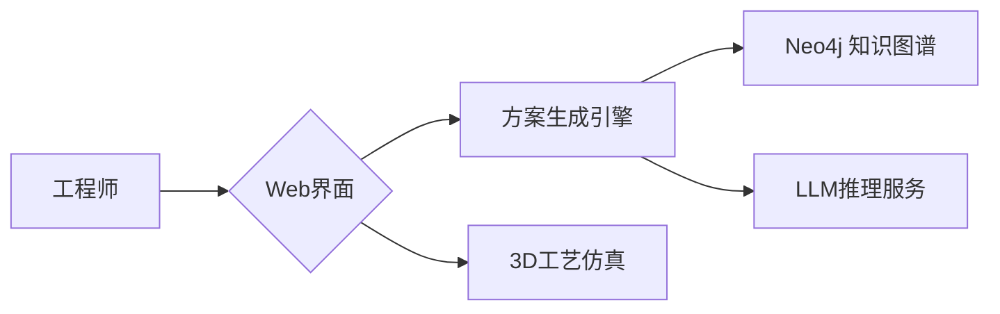

# Design-on-Graph
Design-on-Graph: A graph retrieval-augmented generation-based method to support manufacturing system design

🔗 ​**Knowledge-Aware Manufacturing System Design | 🏗️ LLM+KG Powered Automation**​

---

## 1. 项目整体描述

-本项目提出**Design-on-Graph**方法，这是一个基于**GraphRAG（图检索增强生成）​**的制造系统智能化设计框架，通过大语言模型（LLM）实现领域知识的高效管理与设计方案的自动生成。

-本项目构建的本体和知识图谱可以在github仓库中找到，链接如下：https://github.com/zhengxiaochen/ontology_aircraft_system

### 1.1 核心创新：
- 🧠 ​**知识动态检索**​：采用多轮对话机制智能检索制造领域知识图谱中的结构化约束条件
- 🏭 ​**上下文感知设计**​：利用对话历史归档实现设计知识的持续积累与上下文关联推理
- ✈️ ​**工业级验证**​：以飞机机身连接系统为测试场景构建完整AI代理工作流

### 1.2 技术亮点：
✅ ​**跨模态知识融合**​  
将制造系统的拓扑约束、物理参数等结构化知识（图数据）与自然语言描述（文本数据）统一编码  

✅ ​**多目标优化支持**​  
通过LLM的链式推理能力平衡生产效率、成本控制、性能指标等多维度优化目标  

✅ ​**可解释性设计**​  
所有生成的设计方案均附带知识溯源路径，支持回溯检索到的原始领域知识节点  

### 1.3 核心内容：
The design of large-scale equipment manufacturing systems plays a crucial role in ensuring product performance, optimizing production efficiency, and reducing lifecycle costs. Effective reuse of domain knowledge is essential for maintaining both the quality and efficiency of manufacturing system design. Although existing knowledge graph technologies standardize the representation and storage of such domain knowledge, the complex design constraints and multiple optimization objectives of manufacturing systems still pose significant challenges to the efficient reuse of domain knowledge. Recent advancements in the large language model (LLM) and retrieval-augmented generation (RAG) have led to the emergence of graph retrieval-augmented generation (GraphRAG), which presents a promising approach to overcoming these challenges. This paper proposes a novel GraphRAG-based method, Design-on-Graph, to support knowledge management and automated generation of design plans for manufacturing systems. This method employs the LLM to intelligently retrieve and verbalize structured domain knowledge through multi-turn conversations, achieving high-efficiency knowledge management for manufacturing systems. Additionally, the retrieved domain knowledge is systematically archived within conversation history, providing contextual support for LLM-driven reasoning tasks to streamline automated design processes. Finally, a case study on an aircraft fuselage joint system serves as the test scenario, and an AI agent incorporating all the above functionalities is developed to demonstrate and evaluate the performance of the proposed Design-on-Graph method.

### 1.4 相关论文：
如果您认为我们的代码对您有帮助，请引用以下论文：

[1] Design-on-Graph: A graph retrieval-augmented generation-based method to support manufacturing system design

[2] An Ontology-based Engineering system to supporort aircraft manufacturing system design

[3] A semantic-driven tradespace framework to accelerate aircraft manufacturing system design

[4] Development of an application ontology for knowledge management to support aircraft assembly system design

---

## 2. 核心文件介绍

本项目包含两个协同工作的核心模块，形成从知识推理到可视化应用的完整闭环。

分别是**Design_on_Graph.py**与**app_for_Design_on_Graph.py**，接下来将逐一介绍。


### 2.1 `Design_on_Graph.py` - 核心推理引擎
​**定位**​：制造领域知识图谱与LLM的交互中枢  
▸ 核心功能：  
- ​**知识检索**​：通过SPARQL查询从制造知识图谱中提取拓扑约束、材料属性等结构化数据  
- ​**多轮对话管理**​：维护对话历史上下文（`ConversationBufferWindowMemory`）  
- ​**设计验证**​：检查生成方案与制造标准的合规性  

#### ​**Design-on-Graph核心数据结构手册**​：

```python

##### 1. Main Components

🔗 ###### 1.1 Language Models
llm = ChatOpenAI(model="gpt-4o-mini", temperature=0)
llm_2 = ChatOpenAI(model="gpt-4o", temperature=0)
llm_3 = ChatOpenAI(model="o1-preview", temperature=0)

🔗 ###### 1.2 Graph Database Connection
graph = Neo4jGraph()

🔗 ###### 1.3 Memory Component
memory = ConversationBufferWindowMemory(k=10)


##### 2. Chain Components

🧠 ​###### 2.1 Router Chain
Prompt Template:

router_prompt = PromptTemplate(
    input_variables=["question"],
    template=""" 
You are an intelligent routing assistant responsible for determining whether a question should be answered using the knowledge graph.

Current question: {question}

Please follow the rules below to decide:
1. If the question ​**does not contain**​ "This is a general question" and is clearly related to knowledge graph content (e.g., it contains words like process, operation, resource, predecessor), respond with ​**​"graph"​**.
2. If the question is ​**not related to the knowledge graph**​ (e.g., it contains words like design, scheme, generate, analyze, check), respond with ​**​"general"​**.
3. If the question ​**contains**​ the phrase "This is a general question", always respond with ​**​"general"​**, regardless of other content.
4. If you are unsure, respond with ​**​"graph"​**.

Only respond with ​**​"graph"​**​ or ​**​"general"​**. Do not add any other content.
"""
)

Chain Construction:

router_chain = router_prompt | llm

🧠 ​###### 2.2 Cypher Chain

cypher_chain = GraphCypherQAChain.from_llm(
    llm=llm,
    graph=graph,
    allow_dangerous_requests=True,
    verbose=True,
    exclude_types=[
        "Class", "Relationship", "_GraphConfig", "SCO_RESTRICTION",
        "DOMAIN", "RANGE", "isSubClassOf", "isSubPropertyOf", "hasOptionalAutoOperation",
        "hasOptionalManualOperation"
    ],
    top_k=300,
    return_direct=True,
    return_intermediate_steps=True
)

🧠 ​###### 2.3 Graph Response Chain

Prompt Template:

graph_response_prompt = PromptTemplate(
    input_variables=["question", "graph_data", "cypher"],
    template=""" 
You are a professional assistant for answering questions about aircraft fuselage assembly using knowledge graph results. All query results are directly retrieved from the knowledge graph and are accurate and structured.

Your goal is to help users understand the dependencies and semantics of aircraft assembly operations, based solely on the given data.

Current question: {question}

Cypher query executed: {cypher}

Query results from the knowledge graph: {graph_data}

Instructions:
1. Carefully analyze the query result and extract only the relevant information needed to answer the current question.
2. Present the answer clearly in ​**a structured list format**, making it easy to understand the relationships or dependencies.
3. If the question involves sequences (such as operation dependencies), emphasize ​**precedence relationships**​ and explain them.
4. Do not include or infer any information that is not directly present in the knowledge graph result.
5. Do not omit any values in graph data.
"""
)


Chain Construction:

graph_response_chain = graph_response_prompt | llm_2

🧠 ​###### 2.4 General QA Chain

Prompt Template:

general_qa_prompt = PromptTemplate(
    input_variables=["question", "history"],
    template=""" 
​**Role**: Aircraft Assembly Planning Expert  
​**Task**: You are an expert in aircraft fuselage assembly planning. Your task is to generate a complete and feasible assembly scheme based only on the conversation history and current question.

Conversation history: {history}

Current question: {question}

​**Process Requirements**:
Phase 1. ​**Data Extraction**​  
- Extract ALL operations and resources from conversation history, show them as a table
1. For each operation, document:  
▪ Type (Manual/Automatic)  
▪ Duration (min)  
▪ Required Resources (name (number))  
▪ Immediate Predecessors  
2. For each resource, document:
▪ Cost (€/h)  
▪ Calendar  
▪ Quantity 

Phase 2. ​**Constraint Analysis**​  
- Analysis specific constraints
- Analysis automatic and manual quarter aircraft fuselage assembly logic
- List the sequence chains of operations required to complete one automatic 1/4 body assembly
- List the sequence chains of operations required to complete one manual 1/4 body assembly

Phase 3. ​**Scheme Generation**​  
- Generate a complete aircraft fuselage assembly scheme following the output format, including the assembly of four quarter-fuselages.
- The generated scheme must meet the following requirements：
▪ Only the same manual operations can be carried out in parallel
▪ Automatic operations cannot be carried out in parallel with any other operations
- Output Format:
| Order | Operation | Type | Required Resources | Duration | Start Time | End Time | Parallel Group |
|-------|-----------|------|---------- ---------|----------|------------|----------|----------------|
Note:
▪ Order: Use a single number (1, 2, 3, ...) if it is executed sequentially
▪ Order: Use number + letter suffix (4a, 4b) if it is executed in parallel
▪ Parallel Group: Use letter suffix (a, b)
▪ This plan must include the assembly of four quarter-fuselages.
▪ You must generate a complete list of scheme without any form of omission

Phase 4. ​**Validation Report**:
- Check if the following conditions are met. Mark ✓ if met, and ✗ if not met.
▪ [✓/✗] Completed 4 assemblies of 1/4 body
▪ [✓/✗] Automatic operations are executed sequentially
▪ [✓/✗] No manual/auto overlap
▪ [✓/✗] Shared steps correctly positioned 
▪ [✓/✗] Resource limits maintained
- If any of the conditions is not met, re-execute phase 3.
"""
)

Chain Construction:

general_qa_chain = general_qa_prompt | llm_3


 ``` 

### 2.2 app_for_Design_on_Graph.py - 可视化应用接口

#### ✈️ 核心定位
​**航空装配智能设计工作台**​  
专为飞机机身连接系统设计工程师打造的交互式决策平台，实现：
- ​**知识图谱驱动**​：实时查询制造约束关系（如铆接工序依赖）
- ​**多方案验证**​：自动检查ASME Y14.5-2021标准合规性
- ​**可追溯决策**​：保留所有设计迭代的历史版本对比

#### 🖥️ 技术架构


#### ​**app_for_Design_on_Graph核心数据结构手册**​：

```python


🖼️ ​**UI 组件层 (Gradio)​**​
class UIElements:
    """
    航空装配设计交互界面核心组件
    """
    layout = {
        "header": {
            "logo": gr.Image(value="logo.png"),  # 南科大实验室LOGO
            "title": gr.Markdown("""
                <h1>Design-on-Graph</h1>
                <p>Supported by AI4DESE Laboratory</p>
            """)
        },
        "main": {
            "graph_panel": gr.HTML(  # 知识图谱可视化区
                default_html="...",  # 初始占位内容
                height=650
            ),
            "chat_interface": {
                "chatbot": gr.Chatbot(type="messages"),  # 消息式聊天框
                "input_box": gr.Textbox(placeholder="Ask something..."),
                "buttons": [
                    gr.Button("Send"), 
                    gr.Button("Clear")
                ]
            }
        },
        "examples": [  # 航空装配专用示例按钮
            gr.Button("Process"), 
            gr.Button("Operation"),
            gr.Button("Resource"),
            gr.Button("Required resource"),
            gr.Button("Predecessor"),
            gr.Button("Plan")  # 自动生成四象限机身装配方案
        ]
    }

🗃️ ​​**数据管理层​​**

class DataManager:
    """
    制造知识图谱可视化数据处理器
    """
    # 静态文件管理
    static_files = {
        "storage_path": Path("static"),
        "max_age": 3600,  # 1小时自动清理旧图谱
        "naming_pattern": "graph_*.html"  # 图谱文件命名规则
    }

    # 图谱HTML包装器
    graph_wrapper = """
    <div style='width: 100%; height: 650px; border: 1px solid #ccc;'>
        <iframe srcdoc="{content}" style="width:100%;height:100%;"></iframe>
    </div>
    """

    @classmethod
    def clean_old_graphs(cls):
        """清理过期的知识图谱可视化文件"""
        ...

    @classmethod
    def get_graph_url(cls, path: str) -> str:
        """生成本地图谱文件访问URL (兼容Windows路径)"""
        ...

🤖 ​**​业务逻辑层​​**

class AssemblyChatHandler:
    """
    飞机装配对话处理器
    """
    message_format = {
        "user": {"role": "user", "content": "..."},
        "assistant": {
            "role": "assistant",
            "content": "..."  # 来自smart_qa_system的响应
        }
    }

    workflow = {
        "input_processing": [
            "用户提问 → 清理旧图谱 → 调用推理引擎",
            "知识图谱路径处理 → HTML包装"
        ],
        "output_generation": [
            "更新聊天历史 → 渲染可视化图谱",
            "保持上下文一致性"
        ]
    }

    # 航空装配专用约束检查项
    constraint_checks = [
        "四象限装配完整性",
        "自动/手动工序并行规则",
        "工装夹具使用顺序"
    ]

🌐 ​​**服务配置​​**

class ServerConfig:
    """
    航空专用部署配置
    """
    launch_params = {
        "server_name": "localhost",
        "server_port": 7860,
        "share": False,
        "static_dir": {
            "path": "static",
            "auto_create": True
        }
    }

    # 南科大实验室网络策略
    network_policy = {
        "allowed_origins": ["*.sustech.edu.cn"],
        "cors_enabled": False
    }

```


## 3. 环境配置.env

```ini
# ========================
# ️️️️️✈️ 核心AI服务配置
# ========================
OPENAI_API_KEY=  
OPENAI_BASE_URL=  

# ========================
# ️️️️️🏭 制造知识图谱连接
# ========================
NEO4J_URI=bolt://localhost:7687       
NEO4J_USERNAME=aerospace_engineer    
NEO4J_PASSWORD=
```
